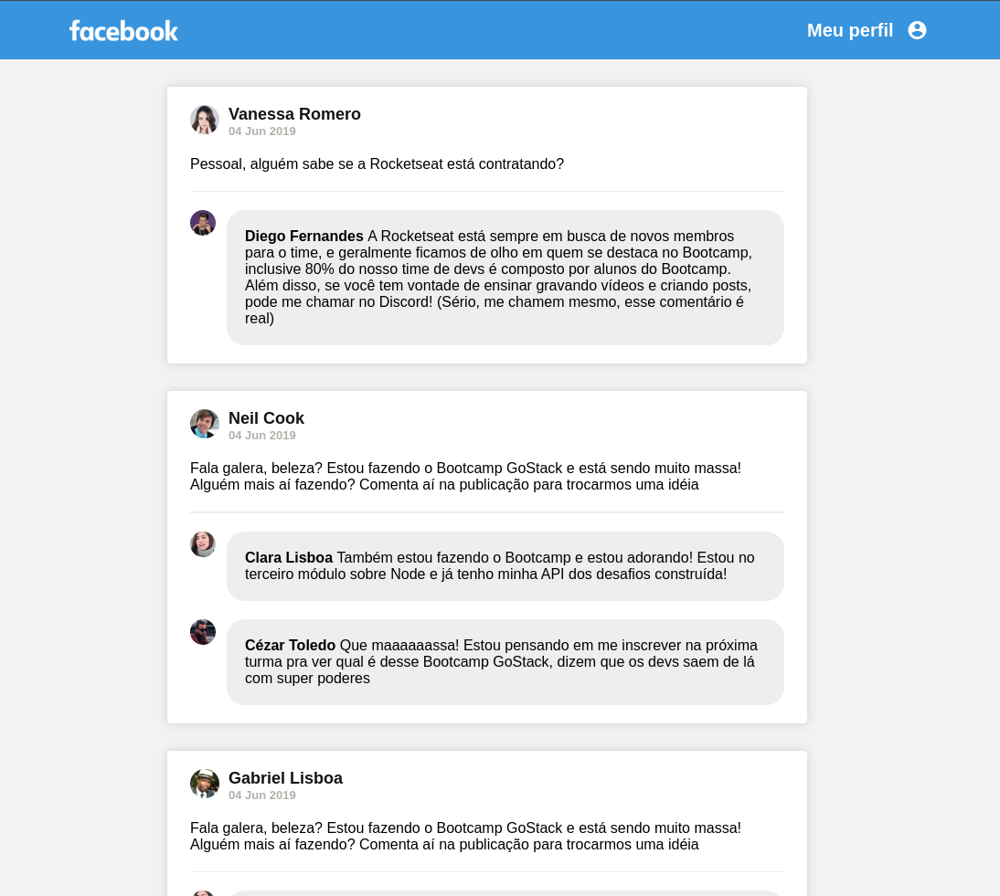

<h1 align="center">
  
</h1>

<h3 align="center">
  GoStack Desafio 04: React Basics
</h3>

## :rocket: Sobre o desafio

Crie uma aplicação do zero utilizando: 
**Webpack**
**Babel**
**Webpack Dev Server**
**ReactJS**.

Nessa aplicação você irá desenvolver uma **interface** semelhante com a do **Facebook** utilizando React.

As informações contidas na interface são **estáticas** e não precisam refletir nenhuma API REST ou back-end.

### Instruções ###
```
yarn install && yarn dev
```
Quando yarn executar, abra: http://localhost:8080/.

### Demo ###


## :memo: Guilherme Ribas
Desafio realizado por Guilherme Ribas.
